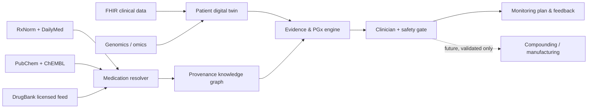

# Tailored Medication

A safety-first, research-oriented foundation for clinician-supervised precision-medication research. The runnable Phase 1 core reconciles medication-product and molecular-entity data without autonomous prescribing, novel-drug release, or unsupervised manufacturing.

## What is implemented

- A canonical record that keeps clinical products separate from molecular entities.
- Explicit product crosswalks and product-to-molecule relationships; shared names never create identity edges.
- Deterministic reconciliation with field-level provenance, confidence, conflicts, and review routing.
- Versioned, replayable offline candidate snapshots for reproducible local runs.
- Bounded adapters for RxNorm/RxNav, DailyMed, PubChem, and ChEMBL; a licensed-source boundary for DrugBank.
- A conservative safety gate that requires complete evidence and strict clinician/pharmacist attestations.
- A dependency-free Node.js reference implementation with a 17-test suite.

## Quick start

```text
node --test
node scripts/demo.mjs
node scripts/resolve.mjs fixtures/aspirin.json
```

Requirements: Node.js 18 or newer. There are no runtime dependencies and no installation step; download the repository and run the commands above. The demo and resolver are fully offline and read `fixtures/aspirin.json`. They intentionally end with a blocked safety decision because no clinician or pharmacist has reviewed the fixture. Pass another snapshot path to `scripts/resolve.mjs` to replay it locally.

The live adapters use public APIs only when called explicitly. Their results are marked `proposed`, include source-version and retrieval-time metadata, and are bounded by a request timeout. They must be verified and stored as governed snapshots before downstream use.

## System shape



See [docs/ARCHITECTURE.md](docs/ARCHITECTURE.md), [docs/DATA-SOURCES.md](docs/DATA-SOURCES.md), and [docs/SAFETY.md](docs/SAFETY.md).

## Current boundary

This repository is a local reconciliation and evidence-boundary library, not a complete clinical platform. Genomics, pharmacogenomics, microbiome, digital-twin, PK/PD, FHIR/OMOP, patient storage, and manufacturing workflows remain future integration contexts. A local open-source LLM may eventually summarize already-verified evidence through a loopback-only adapter, but it must not establish medication identity, invent evidence, choose therapy, or authorize a prescription.

## Scope and safety

This repository is not medical advice, a prescribing system, or a manufacturing control system. Clinical recommendations require validated evidence, jurisdiction-specific governance, a licensed clinician, pharmacist verification, and patient-specific review. Molecular designs are research hypotheses until preclinical, clinical, regulatory, and quality validation is complete.
