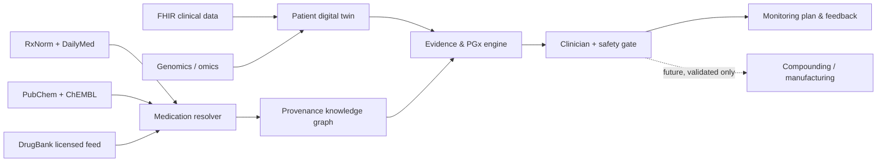

# Precision Medication Platform

A safety-first, research-oriented foundation for a clinician-supervised precision-medicine platform. It starts with what is feasible today: normalization and reconciliation of approved medication, ingredient, chemical, and evidence data—not autonomous prescribing, novel-drug release, or unsupervised manufacturing.

## What is implemented

- A canonical medication/ingredient record that keeps products separate from molecular ingredients.
- Live-source adapters for RxNorm/RxNav, DailyMed, PubChem, and ChEMBL; a licensed-source boundary for DrugBank.
- Deterministic reconciliation with field-level provenance, confidence, conflicts, and manual-review routing.
- A knowledge-graph projection for later FHIR/OMOP, pharmacogenomic, microbiome, PK/PD, and outcome integration.
- Safety gates that prevent a record from being treated as a prescription or manufacturing order.
- A dependency-free Node.js reference implementation and tests.

## Quick start

```powershell
$node = 'C:\Users\Modern Computer\.cache\codex-runtimes\codex-primary-runtime\dependencies\node\bin\node.exe'
& $node --test
& $node scripts/demo.mjs
```

The adapters use public APIs. Keep live calls out of clinical workflows until they are versioned, validated, rate-limited, and replaced by governed data ingestion.

## System shape



See [docs/ARCHITECTURE.md](docs/ARCHITECTURE.md), [docs/DATA-SOURCES.md](docs/DATA-SOURCES.md), and [docs/SAFETY.md](docs/SAFETY.md).

## Scope and safety

This repository is not medical advice, a prescribing system, or a manufacturing control system. Clinical recommendations require validated evidence, jurisdiction-specific governance, a licensed clinician, pharmacist verification, and patient-specific review. Molecular designs are research hypotheses until preclinical, clinical, regulatory, and quality validation is complete.
